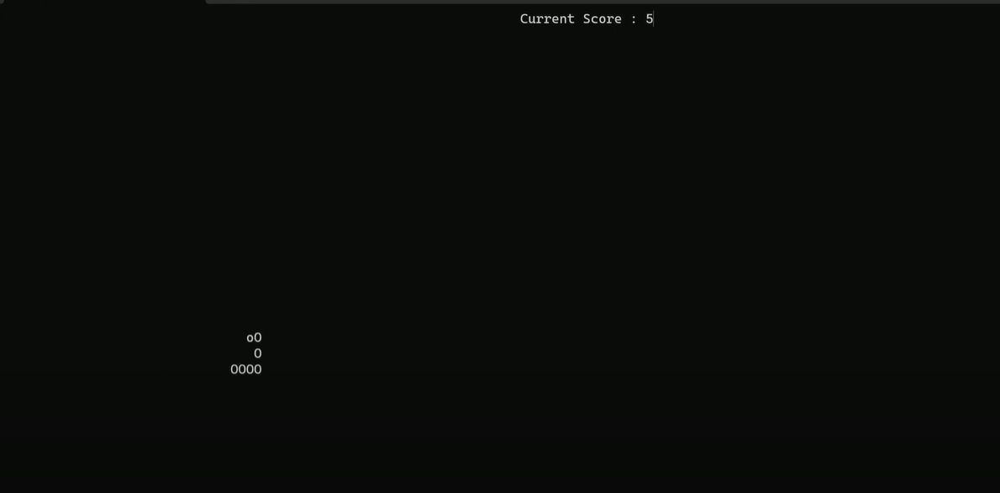

# Snake Game Project Overview
This project is a simple console-based implementation of the classic Snake Game. The game features a snake that grows in length every time it eats food and moves in the four cardinal directions: up, down, left, and right. The game continues until the snake collides with itself or the boundaries of the game area. The player's goal is to control the snake, eat as much food as possible, and maximize the score.

Game Essence
Player Control: The player controls the snake's movement using the 'W', 'A', 'S', and 'D' keys for up, left, down, and right movements, respectively.
Game Objective: The objective is to eat food that randomly spawns on the game board. Each time the snake eats food, its length increases, and so does the player's score. The game ends when the snake runs into itself.
Game Environment: The game is played on a dynamically sized console window, allowing the snake to move freely within the boundaries of the screen.
Key Data Structures
The game's functionality revolves around a few key data structures that efficiently handle the snake's body, movement, and game board elements.

1. Snake Body Representation (Snake Class)
The snake's body is represented as an array of Point objects, which store the coordinates of each segment of the snake's body.

Array (body[MAX_LENGTH]):

The array holds the positions (x and y coordinates) of the snake's segments, with the head being at index 0.
As the snake moves, the positions of the body parts are updated by shifting each segment towards the head.
The array's size is set to a maximum length (MAX_LENGTH), which limits the size of the snake. This ensures efficient memory usage.
Struct Point:

The Point struct defines the coordinates for each part of the snake's body. It stores xCoord and yCoord, representing the position on the game board.
The Point struct is used for both the snake's body and the food's location.
Operations:

Change Direction: The player can change the snake's movement direction by pressing the appropriate keys ('W', 'A', 'S', 'D').
Move: The snake moves one step in its current direction, and each body segment follows the head.
Collision Detection: The game checks if the head has collided with the body or the game boundaries to determine if the game is over.
2. Game Board Representation (Board Class)
The game board provides the environment in which the snake moves and interacts with food.

Dynamic Size:
The size of the game board is determined dynamically based on the console window's dimensions. This ensures the game adapts to different screen sizes.
Food:
Food is represented as a Point object, similar to the snake's body parts. The food is randomly placed on the board, and when the snake eats it, a new piece of food is spawned.
Score:
The player's score is tracked by the Board class. Each time the snake eats food, the score increases by 1.

3. Control Flow
Game Loop:

The main game loop continuously updates the game state until the snake dies (either by colliding with itself or the game boundaries). During each iteration of the loop, the following steps occur:
The game receives input from the player, updating the snake's direction if a key is pressed.
The snake moves according to its current direction.
The board is redrawn to reflect the new state of the snake and food.
The game pauses briefly to control the speed of the snake's movement.
Input Handling:

The game captures user input using non-blocking keyboard input (via kbhit() and getch() functions), allowing the player to control the snake's direction in real-time.
Data Structure Advantages
Array for Snake Body: The array structure used for the snake's body is simple and efficient. Since the snake grows one segment at a time, adding new segments to the array is a quick operation. As long as the snake doesn't exceed the maximum length, this solution works well for this game.

Struct for Coordinates: Using the Point struct to encapsulate the coordinates allows for easy management of the snake's position and food location. It simplifies collision detection and movement logic by treating each body segment and food as individual points.
